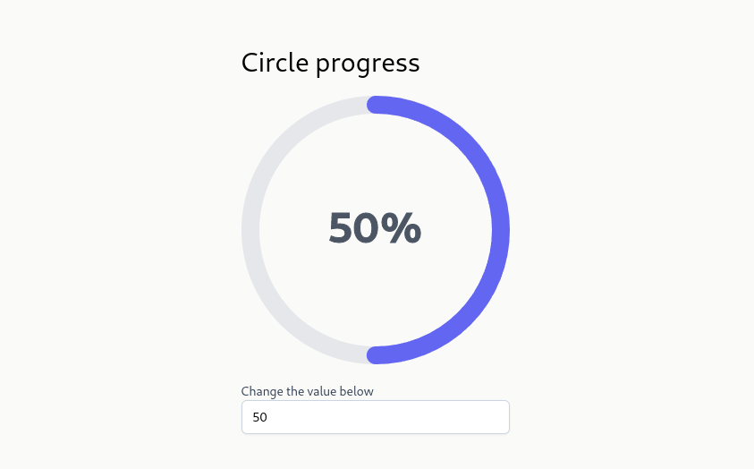

<h1 align="center">
Components 
</h1>

## Introduction

This repository has some components made with [React](https://reactjs.org/) + [TypeScript](https://www.typescriptlang.org/) and [tailwindcss](https://tailwindcss.com/). 

**These project are hosted on this page: https://mouracamila.github.io/components/**

### Circle Progress 

## How to use

1. Clone this Repository:

   `$ git@github.com:mouracamila/components.git`

2. Installing dependencies:

   `$ yarn`

3. Running project:

   `$ yarn start`

##### Obs: **Yarn** should be run where **package.json** is in your project

#### After running the project, in your terminal, this message should be displayed:

    Compiled successfully!

    You can now view my-app in the browser.

    Local:http://localhost:3000

Done!

## License

This project is under license from [MIT](https://en.wikipedia.org/wiki/MIT_License).

---

with ❤ - [MouraCamila](https://github.com/mouracamila)